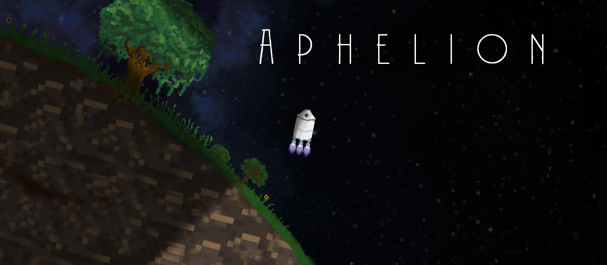

# Aphelion
This is a cool 2D game, check it out, it's based on real physics!

## Compilation
```
mkdir build
cd build
cmake ..
make -j4
```

## Launch the game
The directories `resources/` and `saves/` need to be in the current directory when running the executable.

## Controls
  - ZQSD for translating up, down, left and right with the RCS
  - A and E to rotate with RCS
  - Space to fire the hydrolox engine
  - Shift and Control to zoom and unzoom
  - M to show the map
  - Alt to rotate the camera
